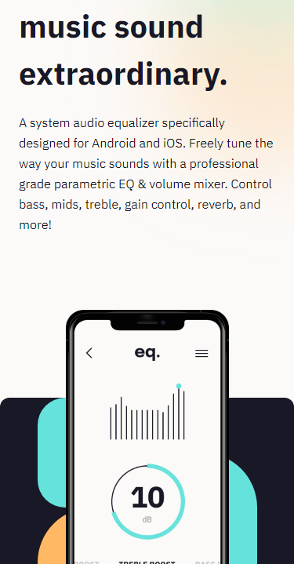
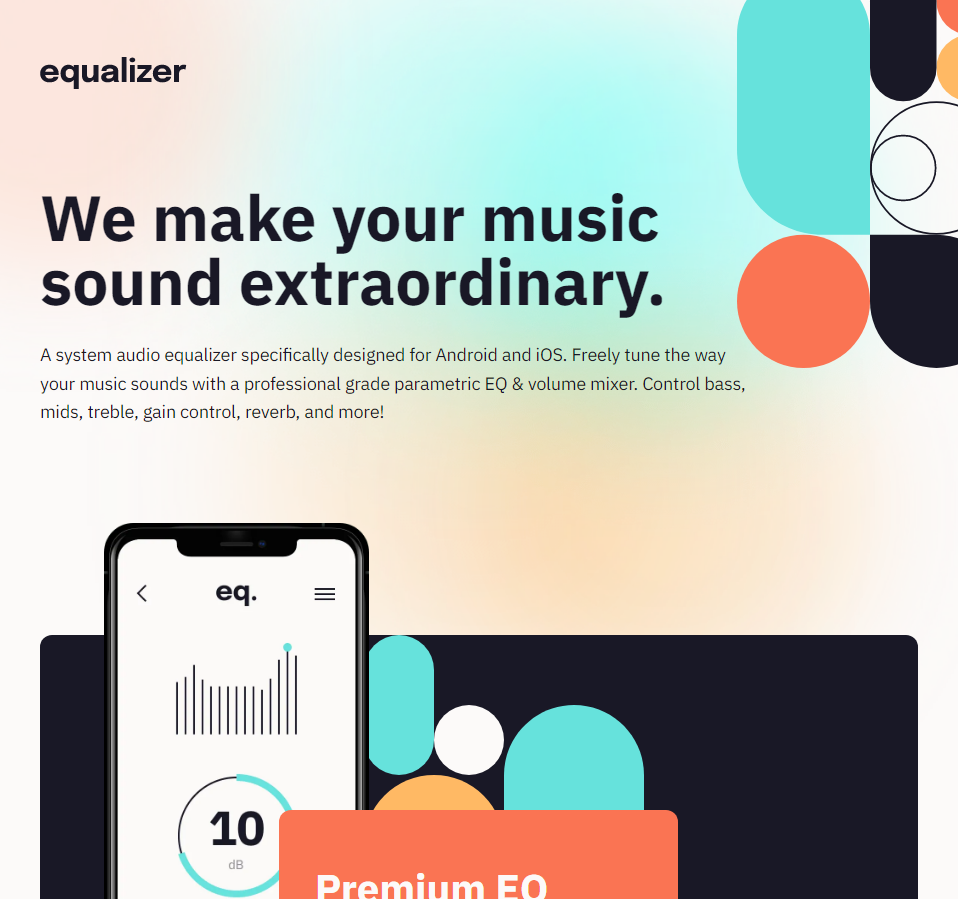

# Frontend Mentor - Equalizer landing page solution

This is a solution to the [Equalizer landing page challenge on Frontend Mentor](https://www.frontendmentor.io/challenges/equalizer-landing-page-7VJ4gp3DE). Frontend Mentor challenges help you improve your coding skills by building realistic projects.

## Table of contents

- [Overview](#overview)
  - [The challenge](#the-challenge)
  - [Screenshot](#screenshot)
  - [Links](#links)
- [My process](#my-process)
  - [Built with](#built-with)
  - [What I learned](#what-i-learned)
  - [Continued development](#continued-development)
- [Author](#author)

## Overview

### The challenge

Users should be able to:

- View the optimal layout depending on their device's screen size
- See hover states for interactive elements

### Screenshot

### Links

- Solution URL: [Add solution URL here](https://your-solution-url.com)
- Live Site URL: [Add live site URL here](https://your-live-site-url.com)

## My process

### Built with

- Semantic HTML5 markup
- Mobile-first workflow
- [Icons](https://react-icons.github.io/react-icons) - Icon library
- [React](https://reactjs.org/) - JS library
- [Next.js](https://nextjs.org/) - React framework
- [Tailwind CSS](https://tailwindcss.com/) - For styles

### What I learned

This project although not heavy with JS was just good practice around HTML and CSS to create the landing apge. I also used this project to practice using Tailwind CSS and Next.js. I also used this project to practice using React Icons.

### Continued development

Going forward with future projects I want to continue learning NextJS 13.3 as well as getting more component with Tailwind CSS. I also want to focus on devling more into React with future prohects that will start to rely more on JS.

## Author

- Website - [DK Coding](https://dk-personal.netlify.app/)
- Frontend Mentor - [@dawkey95](https://www.frontendmentor.io/profile/dawkey95)
